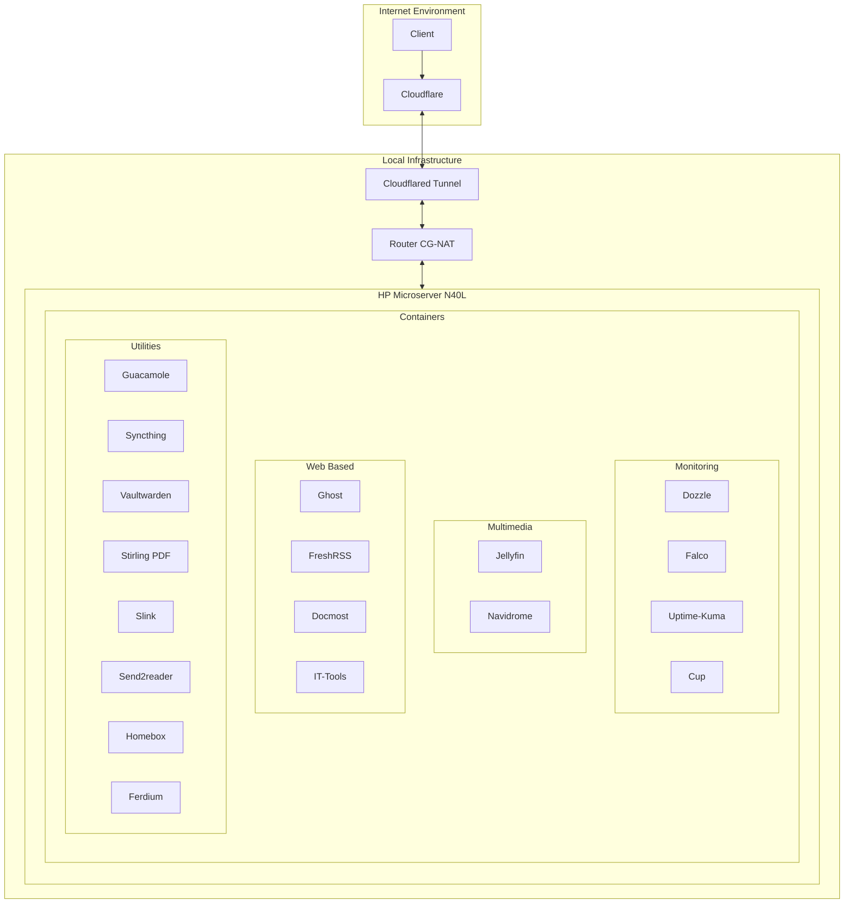

# Self-hosted personal services - HP Microserver N40L
This repository contains config files to guide an instalation using Containers (Docker, Podman), i hope this help you with anything in your server ^^

I made a talk in spanish to Github Latam about start in Self-Hosting Services, you can see in [Youtube](https://www.youtube.com/live/bVE38L8jteM?si=PhLPpdBiGVGlY2Xw)

## 📌 Overview
- Model: HP Microserver N40L
- Location: Santiago - Chile
- Active containers: ~29

## 🔧 Technical Specifications
- Operating System: [Arch BTW](https://archlinux.org/)
- CPU: AMD Turion™ II Neo N40L (2012)
  - Instruction Set: x86-64-v1
- RAM: 4GB
- Storage: 2TB
- Network: 300MB/s

## 🌐 Network Topology

## 🔒 Security
**Network Security**
- [Cloudflare Tunnel](https://www.cloudflare.com/products/tunnel/) for secure remote access
- Support CG-NAT based network like ISP connections without static or dynamic public ip

**Domain Management**
- [Cloudflare managed domains](https://domains.cloudflare.com/)
- SSL/TLS encryption (Not by default, please configure Cloudflare Dashboard)
- DNS configuration through Cloudflare Dashboard

## 🛠 Deployed Services
**Monitoring**
- [Dozzle](https://github.com/amir20/dozzle) - Log viewer
- [Falco](https://github.com/falcosecurity/falco) - Cloud Native Runtime Security
- [Uptime-Kuma](https://github.com/louislam/uptime-kuma) - Monitoring Tools (UP/DOWN)
- [Cup](https://github.com/sergi0g/cup) - Updates monitor for containers

**Multimedia Services**
- [Jellyfin](https://github.com/jellyfin/jellyfin) - Media server
- [Navidrome](https://github.com/navidrome/navidrome/) - Music streaming

**Web Services**
- [Ghost](https://github.com/TryGhost/Ghost) - Publishing platform -> [Read my blog post](https://ghost.deathgabox.work/)
- [Quartz](https://github.com/jackyzha0/quartz) via [shoomey/dockerized-quartz](https://github.com/shommey/dockerized-quartz) - Alternative to Obsidian Publish -> [Read My Notes](https://obsidian.deathgabox.work/)
- [FreshRSS](https://github.com/FreshRSS/FreshRSS) - RSS feed aggregator
- [Docmost](https://github.com/Docmost/docmost) - Documentation platform
- [IT-Tools](https://github.com/CorentinTh/it-tools) - Collection of handy online tools for developers, with great UX.

**Utilities**
- [Guacamole](https://github.com/apache/guacamole-server) via [abesnier/docker-guacamole](https://github.com/abesnier/docker-guacamole) - Remote access gateway
- [Syncthing](https://github.com/syncthing/syncthing) - File synchronization
- [Vaultwarden](https://github.com/dani-garcia/vaultwarden) - Password management
- [Stirling PDF](https://github.com/Stirling-Tools/Stirling-PDF) - PDF manipulation
- [Slink](https://github.com/andrii-kryvoviaz/slink) - Photo storage
- [Send2reader](https://github.com/daniel-j/send2ereader) - Kobo book sender
- [Homebox](https://github.com/sysadminsmedia/homebox) - Home inventory manager
- [Ferdium-server](https://github.com/ferdium/ferdium-server) - Service aggregator

## 📦 Container Management
**Containerization**
- [Podman](https://podman.io/) for container use
- [Podman-Compose](https://github.com/containers/podman-compose) for simple service orchestration with `compose.yaml` files and transparent with adding registry for all images (quay.io, ghcr.io, docker.io/, custom registry, etc)
- Compatible with Docker and Kubernetes (Read this [Blog about](https://www.redhat.com/en/blog/podman-play-kube-updates))
- Reading about [compose specs](https://compose-spec.io/) and [OCI](https://opencontainers.org/), to be agnostic about container provider.

# Extra Info
## Thanks
- General Dotfiles and Linux Guides are in my [Dotfiles Repo](https://github.com/DeathGabox/Dotfiles)
- Inspired on [Atareo Self Hosted Repo](https://github.com/atareao/self-hosted)

## Hardware Limitation
### Old CPU Architecture Constraints
This server runs on an older AMD Turion™ II Neo N40L processor, which only supports the x86-64-v1 instruction set. This leads to several compatibility issues with modern applications.

#### Known Incompatibilities
1. **Applications requiring x86-64-v2 or newer instruction sets:**
   - [Grimoire](https://github.com/goniszewski/grimoire/issues/126)
     * Current workaround: Running on a separate modern laptop
   
   - [MySQL 8 Oracle](https://github.com/docker-library/mysql/issues/1055)
     * Current workaround: Using [mysql-oraclelinux8](https://hub.docker.com/_/mysql/tags?name=oraclelinux8) image
